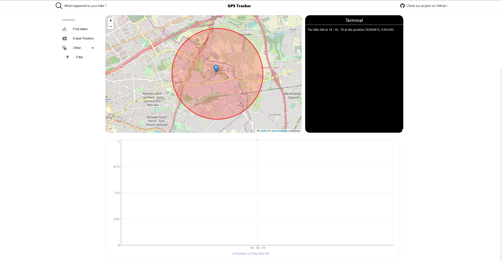
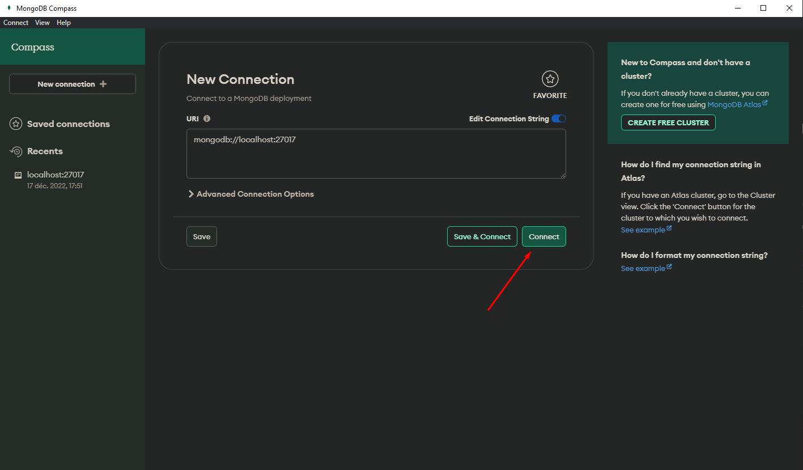
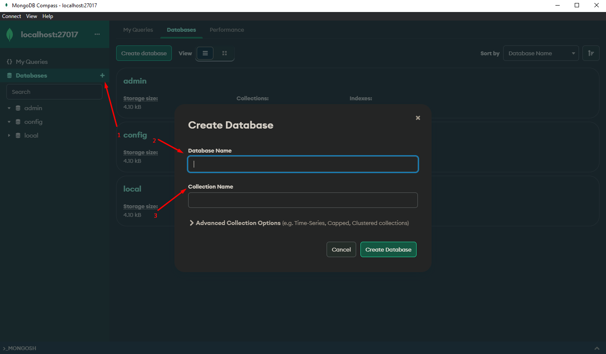

# What's GPS Tracker ?

This application is a GPS tracker that can notice you when a bike has fallen. <br/>
There is a map to show the location of the bike that fell, a terminal to tell you the time and the exact location of the bike and finally a graphic of the number of bikes that fell over the time.



# Get started

1. Be sure to have **Docker** installed on your machine and install mongodb for a persistent storage. <br/>
   In the **IoT-Project** folder:

```
docker-compose up
```

2.  Install MongoDB Compass, connect port 27017 and to the create a database : **Tracker** and a collection : **Tracker** too.
    
    

## Run these commands for the frontend and the backend :

<br />

3. Be sure to be in the **maps** folder.

<br />

```
npm i

npm start
```

<br />

4. Go back in the **backend** folder.

<br />

```
npm i

npm start
```
